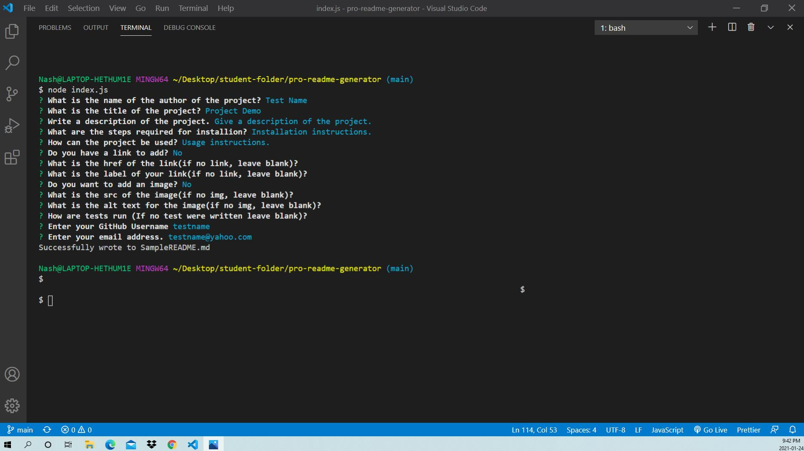
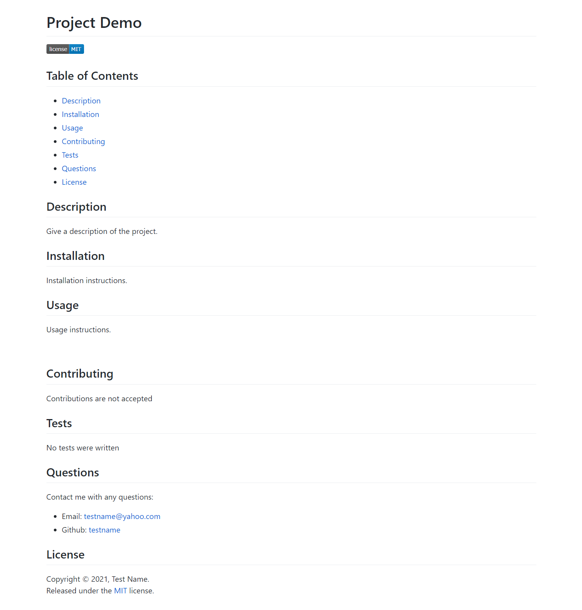

<h1 align=center> README.md Generator</h1>

<p align="center">
 <a href=""></a>
 <a href=""></a>
 <a href=""></a>
 <a href=""></a>
 <a href="https://github.com/nashwalters"></a>
</p>

## Table of Contents
* [Description](#description)
* [Installation](#installation)
  * [Node.js](#node.js)
  * [Node Modules](#node-modules)
* [Usage](#usage)
  * [Demo](#demo)
  * [Screenshots](#screenshots)
* [Contributing](#contributing)
* [Questions](#questions)
* [Credits](#credits)
* [License](#license)

## Description
A well structured, high- quality README is very important, especially for opensource projects. This is the first thing that visitors will see when they discover your project. This is why I created a README.md Generator. You can quickly and easily create a README file by using a command-line application. All you need to do is answer a few questions, and readme-md-generator will do the rest. This allows the project creator to devote more time to working on the project.

A good README.md usually includes what the app is for, how to use the app, how to install it, how to report issues, and how to make contributions. This README.md Generator I created includes those features as well as:
* A table of content
* A test section
* A questions section, that the user can add contact information.
* A license section and a license badge that appears near the top of the README.
* The ability to add a link and an image.
These features made the READM.md Generator a step up from basic.

## Installation
### Node.js
Node.js is required on your local machine. Below I have given a quick guide to get Node.js installed.

1. Open the official page for [Node.js](https://nodejs.org/en/download/) downloads and download Node.js for your device clicking the "Installer" option.

2. Run the downloaded Node.js Installer - including accepting the license, selecting the destination, and authenticating for the install.

3. To ensure Node.js has been installed, run the below command in your terminal - you should get something like v6.14.10.
```bash
node -v
```
4. Update your version of npm.
```bash
npm install npm --global
```

### Node Modules
[Inquirer.js](https://www.npmjs.com/package/inquirer) package was used, run the below command in the terminal for the needed node modules.
```bash
npm install inquirer
```

## Usage
The application is invoked by using the following command:
```bash
node index.js
```
When the command is invoked, the user is prompted for information about the project or the repository. The user's response is taken. A file that is formatted as a markdown is generated and is populated with the users response. See [SampleREADME.md](https://github.com/nashwalters/pro-readme-generator/blob/main/SampleREADME.md) as an example.

### Demo
[Click here to view demo](https://drive.google.com/file/d/1Rb_5jMLZ2luunzGbPHvop5pyrQuSxf9E/view)

### Screenshots





## Contributing
Contributions are welcomed. Please first discuss the change you wish to make via issue or email, before making a change.

#### Step to contribute 
1. Fork the repo on GitHub.
2. Clone the project to your own machine.
3. Commit changes to your own branch.
4. Push your work back up to your fork/branch
5. Submit a Pull Request so that we can review your changes

## Questions       
If you have any questions, I can be reached via:
* <bold>Email</bold>: nash.walters@outlook.com

## Credits
* [Adam Simonini](https://github.com/adamsimonini)
* Carleton University Coding Bootcamp

## License 
Copyright © 2021 Nash Walters,

Released under the [MIT](https://github.com/nashwalters/pro-readme-generator/LICENSE) license.
